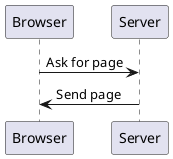

# What is HTTP?
* User Agents
	* Can't control a user agent (many stories on the reg of people getting into trouble for curl)
	* Don't trust them!
* Hostname vs path
	* vs query string
	* vs anchor
	* "Single page apps"
* Client vs Server
	* LAMP
	* Self hosted vs SaaS
- Protocol
	- What's a protocol?
- The core component the web is built on
- "HTTP APIs"
- [[Client vs Server]]
- [[User Agents]]

![[Excalidraw/Drawing 2022-01-16 14.37.16.excalidraw.md]]