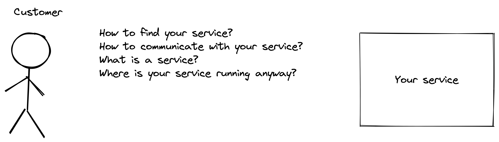
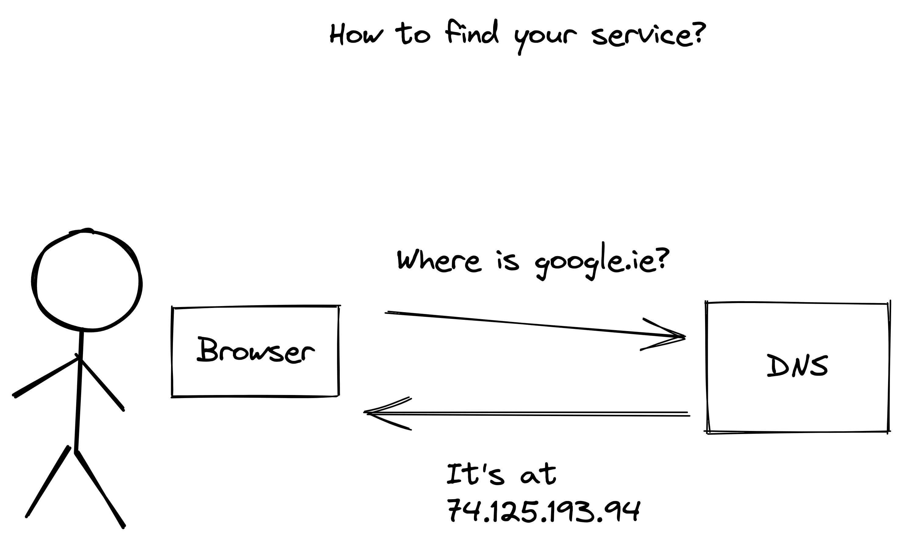
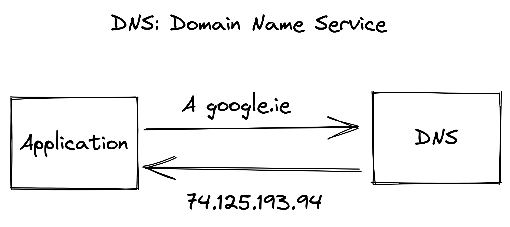
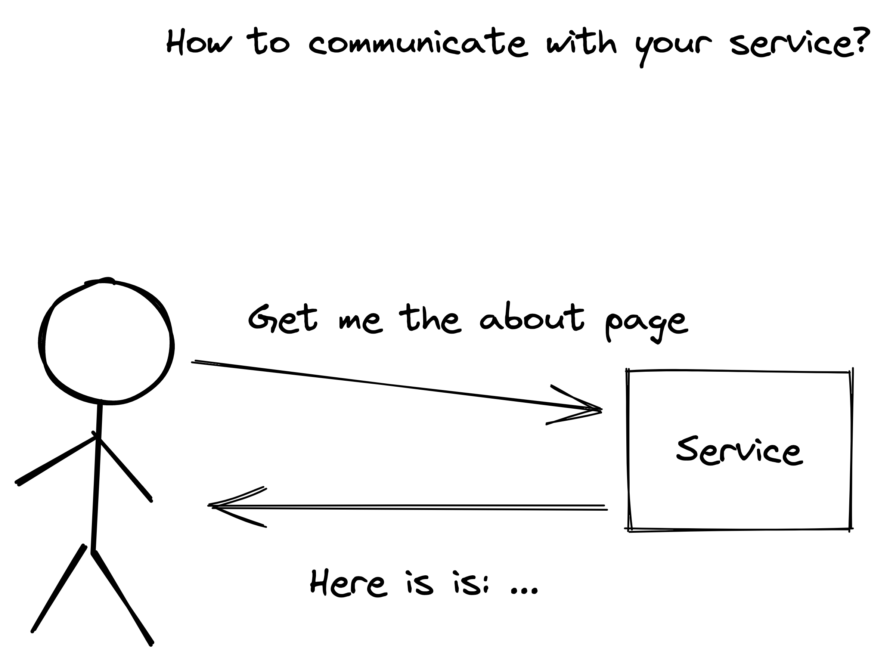
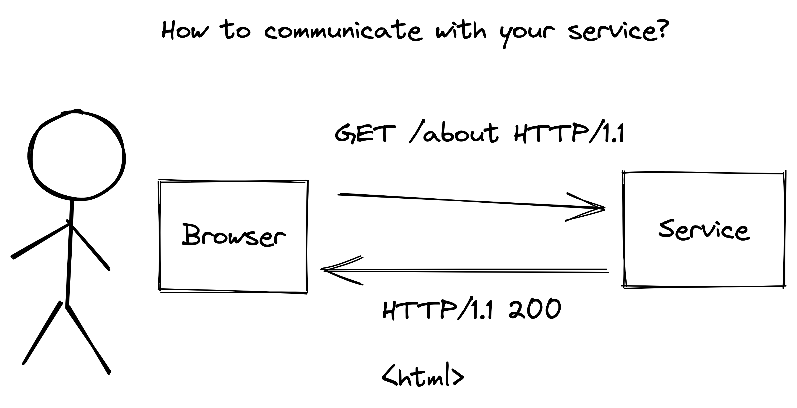
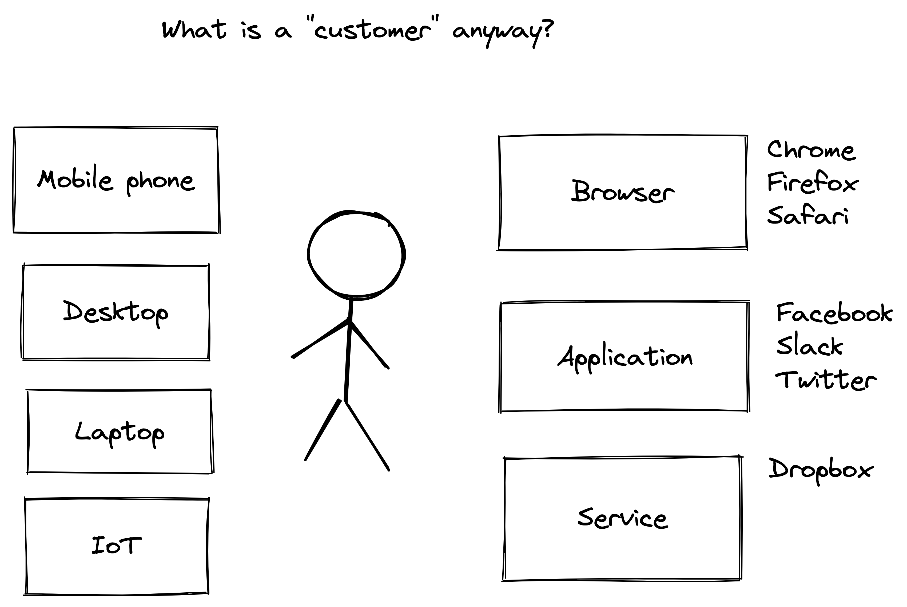
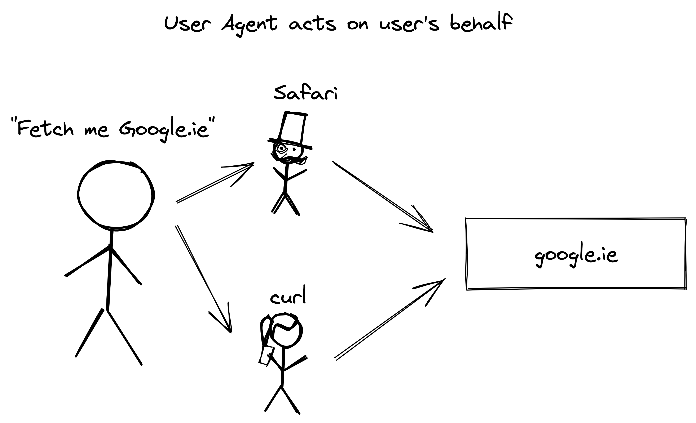
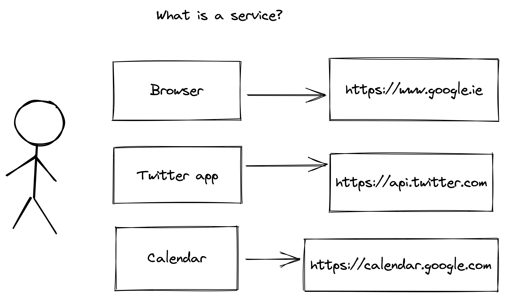

theme: Business Class, 1

# Welcome!

---

# Introduction

A little about me

What I'm hoping to help with

Always stop me to ask questions!

---

# Networking

---

---

# Q: How to find your service?

---

^ talk about IPs!

---

The first solution: a single `HOSTS.TXT`

Really

---

---

# Demo: How I use tools like whois and dig to learn about sites

(MX, CNAME, A)

---

# Buying Domains

Question time!

Who owns `somecompany.com`?

Who owns `www.somecompany.com`?

Who owns `somecompany.io`?

Who owns `.com`?

Bonus: who owns `.`?

---

# Q: How to communicate with your service?

---

---

---

# Q: What is a customer anyway?

---

---

^ Inspired by stories of people being prosecuted for using curl

---

# Q: What is a service?

^ Any program running somewhere, listening on a network port

---

---

# Q: Where is your service running?

Tomorrow's topic!
